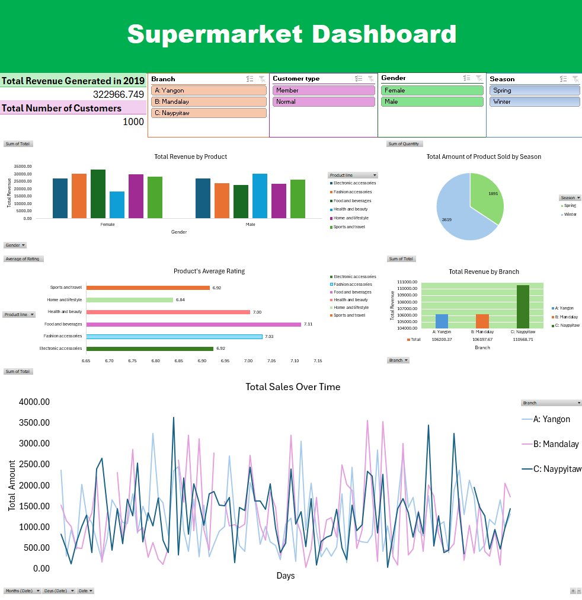

# Supermarket-Dashboard

# Introduction
This is a project I made using the Supermarket Sales dataset on Kaggle to create an interactive excel dashboard. I wanted to get better with Excel’s functionalities, including Pivot Tables, Charts, and key shortcuts, 
while designing a dashboard that provides actionable insights into sales trends, customer behavior, and product performance.

For this project I removed any duplicated rows within the dataset, standardized values for clarity, and created a new column to gather insights 
on seasonal trends. Using Pivot Tables, Pivot Charts, and Slicers, I built an interactive dashboard featuring key visualizations, such as total 
revenue by branch, average product ratings, and total products sold by season. Users can dynamically explore these insights using filters for branch, 
customer type, and season.